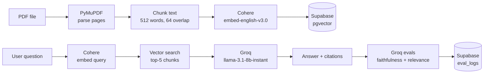

🔗 Live demo: https://docsense.up.railway.app
# DocSense

## What this is

DocSense lets you upload any PDF and ask questions about it in plain English. Instead of reading the whole document yourself, you chat with it. Every answer is pulled directly from the text — the app will tell you which pages it used, and it automatically grades itself: a faithfulness score tells you whether the answer sticks to what the document actually says, and a relevance score tells you how well the retrieved passages matched your question.

---

## Architecture



---

## Setup — step by step from zero

### 1. Clone the repo
```bash
git clone <your-repo-url>
cd docsense
```

### 2. Install dependencies
```bash
pip install -r requirements.txt
```

### 3. Set up your API keys

Copy the example file:
```bash
cp .env.example .env
```

Open `.env` and fill in these four values:

**SUPABASE_URL** and **SUPABASE_KEY**
Go to [supabase.com](https://supabase.com) → your project → **Settings** (left sidebar) → **API**.
- `SUPABASE_URL` is the "Project URL" — it's where your database lives.
- `SUPABASE_KEY` is the "anon public" key — it lets the app read and write data.

**COHERE_API_KEY**
Go to [cohere.com](https://cohere.com) → sign in → **API Keys** (left sidebar) → copy your key.
This key lets the app turn text into numbers (embeddings) for similarity search.

**GROQ_API_KEY**
Go to [console.groq.com](https://console.groq.com) → sign in → **API Keys** → create one and copy it.
This key lets the app generate answers and run self-evaluations — it's free and very fast.

### 4. Run the database migration

Go to your [Supabase dashboard](https://supabase.com) → your project → **SQL Editor** (left sidebar).
Paste the entire contents of `supabase/migration.sql` into the editor and click **Run**.

This creates three tables (documents, chunks, eval_logs), enables the pgvector extension so the database can do similarity search, and adds the `match_chunks` function the app uses to find relevant passages.

### 5. Start the server
```bash
python3 src/main.py
```

### 6. Open the app
Go to [http://localhost:8000](http://localhost:8000) in your browser.

---

## Eval design

### Faithfulness
After generating an answer, the app sends the answer and the retrieved passages back to the language model and asks: "Does this answer contain any claim NOT found in the chunks?" The model replies FAITHFUL or UNFAITHFUL with a one-sentence reason.

**Why it matters:** Language models sometimes make things up (hallucinate). A faithfulness score of 1 means every claim in the answer can be traced back to the document. A score of 0 means the model added something that wasn't there.

### Context relevance
The app also asks the model: "On a scale of 1 to 5, how relevant are these retrieved passages to the question?" The model replies with a number and a brief explanation.

**Why it matters:** Even with a good similarity search, the retrieved chunks might not actually answer the question. A low relevance score means the document may not contain useful information on the topic, or the chunking/embedding isn't matching well.

---

## Results

| Metric | Description | Score |
|---|---|---|
| Faithfulness | Does the answer stay within what the document says? | |
| Context Relevance | How well do the retrieved chunks match the question? | |
| Avg Faithfulness | Average faithfulness across all questions asked | |
| Avg Relevance | Average relevance score across all questions asked | |
